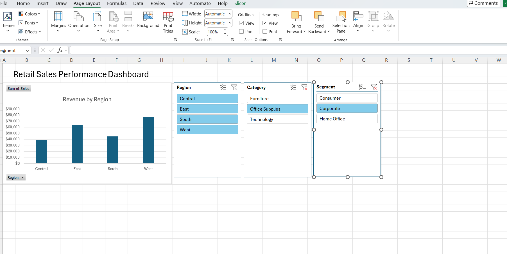
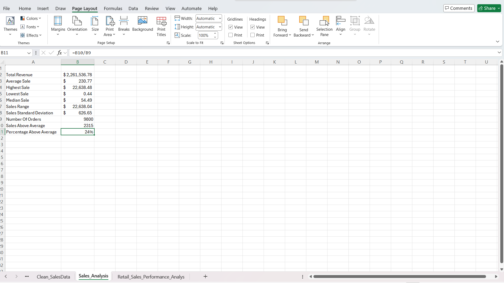

# Superstore Sales Analysis (Excel Dashboard Project)

This project analyzes a retail dataset using Microsoft Excel to uncover sales trends and build an interactive dashboard.

## Dashboard

## KPI Summary

## Project Overview
The goal of this project was to analyze retail sales performance across regions, product categories, and customer segments.

## Key Insights
- The **West region** generated the highest total revenue.
- The **Consumer segment** contributed the most sales.
- The **Technology category** produced the highest revenue.
- **New York City** generated the highest city-level revenue.
- The **South region** showed the highest average sale amount.

## Skills Demonstrated
- Data cleaning using **Power Query**
- Pivot table analysis
- KPI calculations
- Interactive Excel dashboards
- Business data analysis

## Tools Used
- Microsoft Excel
- Power Query
- Pivot Tables
- Data Visualization

## Files
- `Retail_Sales_Performance_Analysis.xlsx` – Full Excel workbook
- `dashboard.png` – Dashboard screenshot
- `KPI_summary.png` – KPI summary screenshot
